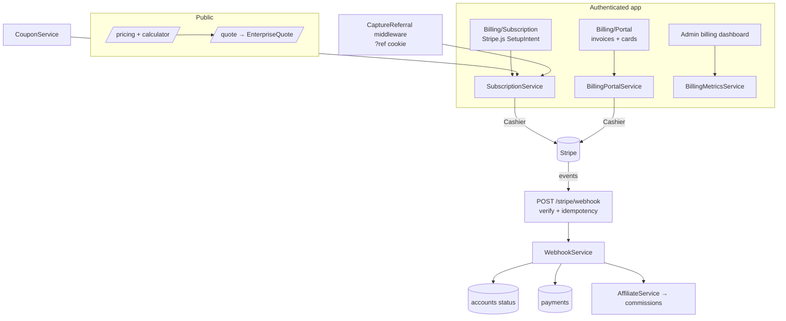
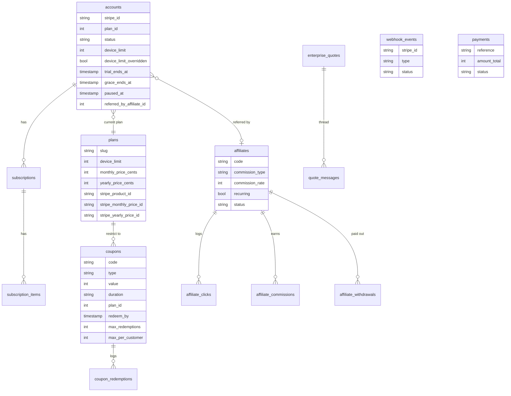

# PioDeploy Billing — Operations & Reference

Companion to `BILLING.md` (which documents each phase). This is the operator's
guide: install, configure Stripe, deploy, run, test, and troubleshoot — plus
the architecture, database and API reference, and the security checklist.

---

## 1. Installation

The billing system is part of the main app; there is no separate install.

```bash
git clone <repo> && cd piodeploy-platform
composer install --no-dev --optimize-autoloader
npm ci && npm run build
cp .env.example .env && php artisan key:generate
php artisan migrate
php artisan db:seed --class=RolesAndPermissionsSeeder
php artisan db:seed --class=PlanSeeder          # the 7 plans (idempotent)
```

Dependencies added for billing: `laravel/cashier` (^16) and `stripe/stripe-php`
(^17), pulled by `composer install`.

---

## 2. Environment variables

| Key | Purpose |
|---|---|
| `STRIPE_KEY` | Publishable key (`pk_test_…` / `pk_live_…`) |
| `STRIPE_SECRET` | Secret key (`sk_test_…` / `sk_live_…`) |
| `STRIPE_WEBHOOK_SECRET` | Webhook signing secret (`whsec_…`) |
| `CASHIER_CURRENCY` | Default currency (e.g. `usd`) |
| `QUEUE_CONNECTION` | `database` (or `redis`) — emails/notifications queue here |
| `CACHE_STORE`, `SESSION_DRIVER` | `database` in this install |

**You do not have to edit `.env` for Stripe keys.** They can be entered in the
portal at **Admin → Billing → Billing settings** (`/admin/billing`); the secret
and webhook secret are **encrypted at rest** (`StripeSettingsService`) and
applied over the config at boot. `.env` still wins when nothing is saved there.

---

## 3. Stripe setup (test mode first)

1. **Keys** — Stripe dashboard → Developers → API keys. Paste `pk_test_…` and
   `sk_test_…` into `/admin/billing` (or `.env`) and save.
2. **Products & prices** — create them from the local plan catalogue:
   ```bash
   php artisan billing:sync-stripe        # --dry-run to preview first
   ```
   Idempotent: it stores `stripe_product_id` / `stripe_*_price_id` on each plan
   and reuses them on re-runs.
3. **Webhook** — Developers → Webhooks → **Add endpoint**:
   - URL: `https://<host>/stripe/webhook`
   - Events: `customer.subscription.created/updated/deleted`, `invoice.paid`,
     `invoice.payment_failed`, `charge.refunded`
     (`checkout.session.completed`, `payment_intent.*` are accepted too).
   - Copy the **Signing secret** (`whsec_…`) into `/admin/billing` and save.
4. **Try it** — `/billing/subscription` → pick a plan → Stripe test card
   `4242 4242 4242 4242` → start the 14-day trial. Watch events land in
   **Admin → Billing → Webhooks**.

Going live: swap the test keys for live keys, re-run `billing:sync-stripe`, and
add a live-mode webhook endpoint.

---

## 4. Deployment

```bash
cd /var/www/piodeploy && sudo bash deploy/deploy.sh
php artisan db:seed --class=PlanSeeder --force
```

`deploy.sh` runs `git pull`, `composer install`, `php artisan migrate`, and
rebuilds assets/caches. The plan seeder is a separate one-time command. After
deploy, set the Stripe keys at `/admin/billing` and run `billing:sync-stripe`.

---

## 5. Scheduler & queues

The scheduler must be running for trial reminders (and existing fleet jobs):

```
* * * * * cd /var/www/piodeploy && php artisan schedule:run >> /dev/null 2>&1
```

Billing schedule entry (see `routes/console.php`):

| Command | Cadence | What |
|---|---|---|
| `billing:trial-reminders` | daily 09:00 | emails the 3-days-left notice, once per trial |

**Queues** — notifications (`TrialStarted`, `TrialEnding`, `PaymentFailed`,
`PaymentReceipt`, `SubscriptionCancelled`) implement `ShouldQueue`. Run a worker:

```
php artisan queue:work --queue=default
```

Without a worker on a `database`/`redis` queue, mail is deferred until one runs.

---

## 6. Testing

```bash
php artisan test                     # full suite
php artisan test --filter=Billing    # billing feature tests
```

The suite runs on **sqlite in-memory** (see `phpunit.xml`) and needs no Stripe:
every money path is tested offline. Live Stripe round-trips (SetupIntent, swap,
invoice PDF, `withCoupon`) are verified manually in **test mode**.

> Operator note (this dev box): MySQL is down and `php artisan` boots against it
> first, so prefix local runs with a sqlite env:
> `DB_CONNECTION=sqlite DB_DATABASE=:memory: CACHE_STORE=array SESSION_DRIVER=array php artisan test`.

Billing test files: `PricingServiceTest`, `BillingPricingApiTest`,
`PublicPricingPageTest`, `BillingAccountTest`, `TrialLifecycleTest`,
`BillingLifecycleTest`, `BillingWebhookTest`, `BillingPortalTest`,
`BillingSettingsTest`, `BillingEnforcementTest`, `CouponSystemTest`,
`AffiliateSystemTest`, `BillingDashboardTest`.

---

## 7. Troubleshooting

| Symptom | Cause / fix |
|---|---|
| Billing screens show "not configured" | No Stripe keys — set them at `/admin/billing` and reload |
| `billing:sync-stripe` says "No Stripe secret key configured" | `STRIPE_SECRET` not set (env or `/admin/billing`) |
| Trial start fails "no Stripe price for …ly" | Run `php artisan billing:sync-stripe` to create prices |
| Webhook events show **failed** in the dashboard | Open the event, read the error, click **Retry** after fixing |
| Webhook returns 400 | Signature mismatch — the `whsec_…` in settings differs from Stripe's |
| Prepaid card rejected at signup | By design (fake-account defence) — use a credit/debit card |
| New agent enrollment returns **402** | Fleet is at the plan's device limit — upgrade or raise the override on `/billing/subscription` |
| Stored secret "could not be decrypted" in logs | `APP_KEY` changed — re-enter the Stripe keys at `/admin/billing` |

---

## 8. Architecture



**Money** is always integer **cents**; `PricingService` is the single source of
truth for turning a device count into a price. **Status is derived** from the
local Cashier subscription (`SubscriptionService::deriveStatus`), never guessed.

---

## 9. Database



Tables added by billing: `plans`, `enterprise_quotes`, `quote_messages`,
`accounts`, `subscriptions`, `subscription_items`, `webhook_events`, `coupons`,
`coupon_categories`, `coupon_redemptions`, `affiliates`, `affiliate_clicks`,
`affiliate_commissions`, `affiliate_withdrawals` (plus `payments`, reused for
revenue).

---

## 10. API reference

**Public, read-only** (rate limited, no customer data):

| Method | Route | Body / result |
|---|---|---|
| GET | `/api/v1/billing/plans` | active plans (cents + dollars + features) |
| POST | `/api/v1/billing/pricing/calculate` | `{devices}` → recommended plan + monthly/yearly/per-device/savings, or `is_enterprise` |
| POST | `/quote` | enterprise quote intake (web form, `throttle:6,1`) |
| POST | `/stripe/webhook` | Stripe events (HMAC-verified, idempotent) |

**Authenticated app** (all gated by `permission:settings.manage` + the
`manage-billing` gate, except `/affiliate` which is any signed-in user):

| Route | Screen |
|---|---|
| `/billing/subscription` | plan/interval, card (SetupIntent), coupon, lifecycle actions, device-limit override |
| `/billing/invoices` (+ `/{id}/download`) | invoices + PDF, upcoming charge, payment methods |
| `/admin/billing-overview` (+ `/export`) | MRR/ARR/revenue/churn/LTV + CSV |
| `/admin/coupons` | coupon CRUD + analytics |
| `/admin/affiliates` (+ `/export`) | affiliate management + CSV |
| `/admin/webhooks` | webhook log + retry |
| `/admin/billing` | Stripe keys + currency (encrypted) |
| `/affiliate` | affiliate self-dashboard (link, stats, payout) |

Agent register endpoint returns **402** `device_limit_reached` when the fleet
exceeds the plan limit.

---

## 11. Security checklist (Module 17)

| Control | How it's enforced |
|---|---|
| **CSRF** | Livewire/web forms tokened; `stripe/webhook` + `billing/webhook` exempt and **HMAC-verified** instead |
| **Webhook auth** | HMAC-SHA256 signature (`BillingService::verifyWebhook`, 5-min skew) + **idempotency** by Stripe event id |
| **Rate limiting** | pricing API `60/min`, quote `6/min`, agent lanes throttled; webhook rejects bad signatures fast |
| **Authorization** | every admin/billing route behind `permission:settings.manage`; every Livewire mutation calls `authorize('manage-billing')`; Super Admin via `Gate::before` |
| **Encrypted secrets** | Stripe secret + webhook secret encrypted at rest (`Crypt`), **write-only** in the form |
| **Audit logs** | sensitive billing mutations recorded via `activitylog` |
| **Server-side validation** | all forms + API validate server-side; money in integer cents; `%>100` and negative values rejected |
| **No client trust** | card data never reaches the server (Stripe.js); prices/discounts/commissions computed server-side; coupon/affiliate limits enforced in services |
| **No card storage** | PANs never touch the app — Stripe SetupIntent + payment-method ids only |
| **IDOR** | invoice download 404s a not-ours id; single-account model scopes data to `Account::current()` |

### Known limitations (accepted, low risk)

- **Coupon usage caps under high concurrency** — `max_redemptions` /
  `max_per_customer` are checked then incremented without a lock. Practically
  self-limiting: each redemption requires a full Stripe subscription create with
  a live card, so a race is not a realistic abuse path.
- **First-touch referral attribution** — the `?ref` cookie is customer-set, so a
  customer could attribute their own payments to an affiliate code. Intended as
  first-touch; monitor affiliate conversions for self-referral if commissions
  scale up.
- **Legacy + new webhook endpoints** — register **only** `/stripe/webhook` in
  Stripe. The deprecated `/billing/webhook` (graduated checkout) also logs a
  payment; registering both would double-count revenue for hosted-Checkout
  subscriptions. The trial-first flow uses `/stripe/webhook` only.
